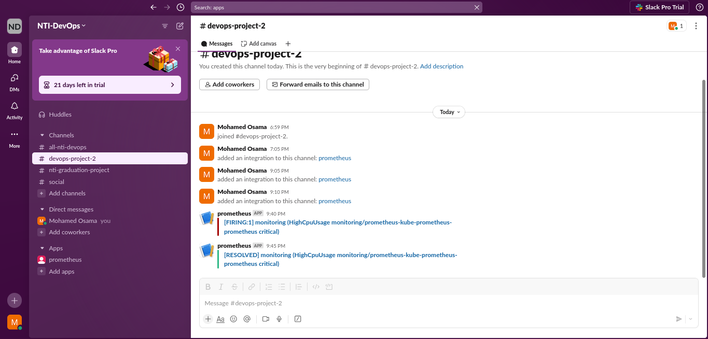

# 🌟 CI/CD Pipeline for a Java Application with Github Actions


This project showcases a fully automated **CI/CD pipeline** for a Java application, utilizing **GitHub Actions** for seamless integration, simplicity, and efficiency. The pipeline includes provisioning, build, testing, artifact management, deployment, and monitoring stages.

---

## 🖥️ Project Overview

- **Application**: Java (built with Maven)  
- **Code Quality**: SonarQube  
- **Artifact Management**: JFrog Artifactory  
- **Monitoring**: Prometheus & Grafana  
- **Orchestration**: Kubernetes (EKS)  

---

## 🛠️ Key Highlights

### 1️⃣ **Provisioning Infrastructure with Terraform**
- Deployed:
  - **EKS cluster** in AWS to manage Kubernetes workloads.
  - **SonarQube server** on a dedicated EC2 instance for code quality analysis.

---

### 2️⃣ **GitHub Actions Workflow**
- **Build & Test**:
  - Checked out the GitHub repository.
  - Built the Java application using **Maven**.
  - Ran unit tests to validate code functionality.
  - Performed code quality analysis using **SonarQube Scanner**.
  - Waited for the **SonarQube Quality Gate** approval before proceeding.

- **Artifact Management**:
  - Published the JAR artifact to the **JFrog Artifactory Maven repository**.
  - Built and pushed Docker images to the **JFrog Artifactory Docker repository**.

- **Deployment on Kubernetes**:
  - Applied Kubernetes manifests to deploy the Java application.
  - Configured a **LoadBalancer service** to expose the application externally.
  - Deployed **Prometheus** and **Grafana** using Helm for monitoring and alerting.

---

## 📋 Getting Started

### Prerequisites
Ensure the following tools are installed:
- **Terraform**: v1.5+
- **AWS CLI**: v2+
- **Git**
---

### Installation Steps

1. **Clone the Repository**  
   Clone the project repository:
   ```bash
   git clone  https://github.com/mohammedd2510/DevOps_CICD_Project_2
   cd DevOps_CICD_Project_2

2. **Set Up AWS Credentials**  
   Configure AWS CLI with your AWS account credentials:  
   ```bash
   aws configure   

3. **Provision Infrastructure with Terraform**  
Navigate to the `terraform` directory, replace the backend S3 bucket name in `Provider_init.tf` with your own, initialize Terraform, and apply the configuration:
    ```bash
    cd ./terraform
    # Replace the backend S3 bucket in Provider_init.tf
    terraform init
    terraform apply

4. **Create Your JFrog Artifactory**:  
   Set up your own JFrog Artifactory by following these steps:  

   - Visit [JFrog Artifactory](https://jfrog.com/artifactory/) and create a free-tier account (or use an existing account).  
   - Create two repositories:  
     - **Maven Repository**: For storing JAR artifacts.  
     - **Docker Repository**: For storing Docker images.  
   - Obtain the **repository URLs** and the **authentication tokens/credentials** for integration in the pipeline.  

5. **Configure GitHub Secrets**:  
   Add the necessary credentials to your GitHub repository secrets for secure access:  

   - `AWS_ACCESS_KEY_ID` and `AWS_SECRET_ACCESS_KEY` for AWS access.  
   - `SONARQUBE_TOKEN` for SonarQube authentication.  
   - `JFROG_USERNAME` and `JFROG_PASSWORD` for JFrog Artifactory.  
   - `JFROG_MAVEN_REPO_URL` and `JFROG_DOCKER_REPO_URL` for your Maven and Docker repositories in JFrog.  

6. **Trigger GitHub Actions Workflow**:  
   Push a change to the repository or manually trigger the workflow in GitHub Actions to start the pipeline. The workflow will:  

   - Build the Java application with Maven.  
   - Run unit tests and analyze code quality with SonarQube.  
   - Publish the JAR artifact to your JFrog Maven repository.  
   - Build a Docker image and push it to your JFrog Docker repository.  
   - Deploy the Java application to the EKS cluster.  
   - Configure monitoring with Prometheus and Grafana.  

## 📄 Project Summary  

This project demonstrates a fully automated **CI/CD pipeline** for a Java application, showcasing advanced DevOps practices using modern tools and workflows.  

Key achievements include:  
- **Infrastructure Provisioning**: Automated the setup of an EKS cluster and a dedicated SonarQube server using Terraform.  
- **CI/CD Pipeline**: Built and deployed a pipeline with GitHub Actions to automate build, test, code quality analysis, artifact storage, and application deployment.  
- **Artifact Management**: Integrated JFrog Artifactory for managing JAR artifacts and Docker images.  
- **Monitoring and Alerts**: Deployed Prometheus and Grafana for real-time monitoring and alerting, with custom dashboards for application metrics.  

This project emphasizes the seamless integration of Infrastructure as Code (IaC), CI/CD pipelines, container orchestration, and monitoring, delivering a robust, production-ready workflow.  

## 📷 Screenshots and Diagrams  

Here are some key visuals and diagrams from the project to illustrate the workflow and results:  

### 1. **GitHub Actions Workflow Success**  

This screenshot shows the successful completion of the GitHub Actions workflow, where the Java application is built, tested, and analyzed as part of the CI/CD pipeline.
  

### 2. **SonarQube Code Analysis Results**  

SonarQube results showing the code quality analysis of the Java application, highlighting potential bugs, vulnerabilities, and code smells.    

### 3. **SonarQube Quality Gate**  

SonarQube Quality Gate configuration, defining the criteria for quality approval. The application must meet these standards to pass the pipeline.   

### 4. **JFrog Artifactory**  

JFrog Artifactory repository where the JAR artifacts and Docker images are stored. The JAR file is uploaded after passing the quality gate, and the Docker image is pushed once built. 

### 5. **Grafana Custom Dashboard**  

The Grafana custom dashboard for monitoring the EKS cluster, showcasing real-time CPU usage and alert data visualization.
  
### 6. **Slack Notification for High CPU Usage**  

A Slack notification triggered by Prometheus when the CPU usage exceeds a threshold in the EKS cluster, keeping you informed in real time. 

### 7. **Java Application Through Load Balancer**  

The Java application is successfully deployed and accessed via a Load Balancer service in the Kubernetes cluster, ensuring high availability and scalability.  

## 🚀 Conclusion

This project has been a comprehensive learning experience, from provisioning infrastructure using **Terraform** to automating the CI/CD pipeline with **GitHub Actions**. By leveraging tools like **SonarQube**, **JFrog Artifactory**, **Prometheus**, and **Grafana**, I was able to establish a fully automated and scalable deployment pipeline for a **Java application** on **Amazon EKS**.

Key takeaways include:

- **Infrastructure as Code**: Successfully provisioned resources on AWS using Terraform, ensuring consistent and repeatable environments.
- **CI/CD Automation**: Integrated code quality analysis, artifact management, and deployment automation using GitHub Actions, ensuring a streamlined pipeline.
- **Monitoring and Alerts**: Configured monitoring and alerting with Prometheus and Grafana, ensuring real-time visibility into system performance.
- **Seamless Deployment**: Deployed a Java application to Kubernetes and managed it with a Load Balancer, achieving high availability and reliability.

Overall, this project reinforced my understanding of DevOps best practices and provided valuable hands-on experience with key tools and platforms used in modern DevOps pipelines. It was a great opportunity to deepen my expertise in CI/CD, container orchestration, cloud infrastructure, and monitoring.


